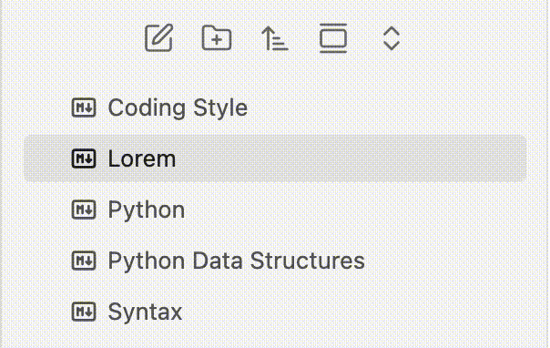

# Single Click Focusing (Obsidian Plugin)

Allows focusing files and folders in the file explorer with a single left click. 

**Motivation**: The default Obsidian file explorer requires multiple clicks to rename a file or folder. This plugin alters the behavior to match the native **macOS Finder** interaction model, where a single click on an item selects and focuses it, allowing you to instantly press `Enter` to rename it.

## Features

- **Files**: Clicking a file will open it normally, but immediately return keyboard focus (and the focus outline) back to the file explorer. This allows you to press `Enter` to rename it or use arrow keys to navigate immediately without manually clicking the explorer again.
- **Folders**: Clicking a folder's name will select and focus it, *without* automatically expanding or collapsing it. You can press `Enter` to rename it. To expand or collapse a folder, click the arrow (`>`) icon on the left.

## Demo

## Installation

### Community Plugins
1. Search for **Single Click Focusing** in Obsidian's Community Plugins.
2. Click **Install** and then **Enable**.

### Manual Installation
1. Download the latest `main.js` and `manifest.json` from the [Releases](https://github.com/thisiselijah/obsidian-single-click-focusing-plugin/releases) page.
2. Place them in your vault's `.obsidian/plugins/single-click-focusing/` folder.
3. Reload Obsidian and enable the plugin.

## Star History

## Star History

<a href="https://www.star-history.com/?repos=thisiselijah%2Fobsidian-single-click-focusing-plugin&type=timeline&legend=top-left">
 <picture>
   <source media="(prefers-color-scheme: dark)" srcset="https://api.star-history.com/chart?repos=thisiselijah/obsidian-single-click-focusing-plugin&type=timeline&theme=dark&legend=top-left&sealed_token=SsoXFS0vv-TmLcEfnhRXlAyvTEwnbc6WwSyi49iv5kLXfwfjYPRHkz6LRiwQDDB5Afy05MypySCjZny7E6w5X7Uuv29SjXkLRFdlFAGH3I5ERtUFQs15Bclm9j0BKbbkHGatP6v_cLEADLY1vG4gFtY0g1ah7uN64Y97EXINeGnwkVcsy9JRblonCwmP" />
   <source media="(prefers-color-scheme: light)" srcset="https://api.star-history.com/chart?repos=thisiselijah/obsidian-single-click-focusing-plugin&type=timeline&legend=top-left&sealed_token=SsoXFS0vv-TmLcEfnhRXlAyvTEwnbc6WwSyi49iv5kLXfwfjYPRHkz6LRiwQDDB5Afy05MypySCjZny7E6w5X7Uuv29SjXkLRFdlFAGH3I5ERtUFQs15Bclm9j0BKbbkHGatP6v_cLEADLY1vG4gFtY0g1ah7uN64Y97EXINeGnwkVcsy9JRblonCwmP" />
   
 </picture>
</a>

## License

This project is licensed under the [MIT License](LICENSE).
